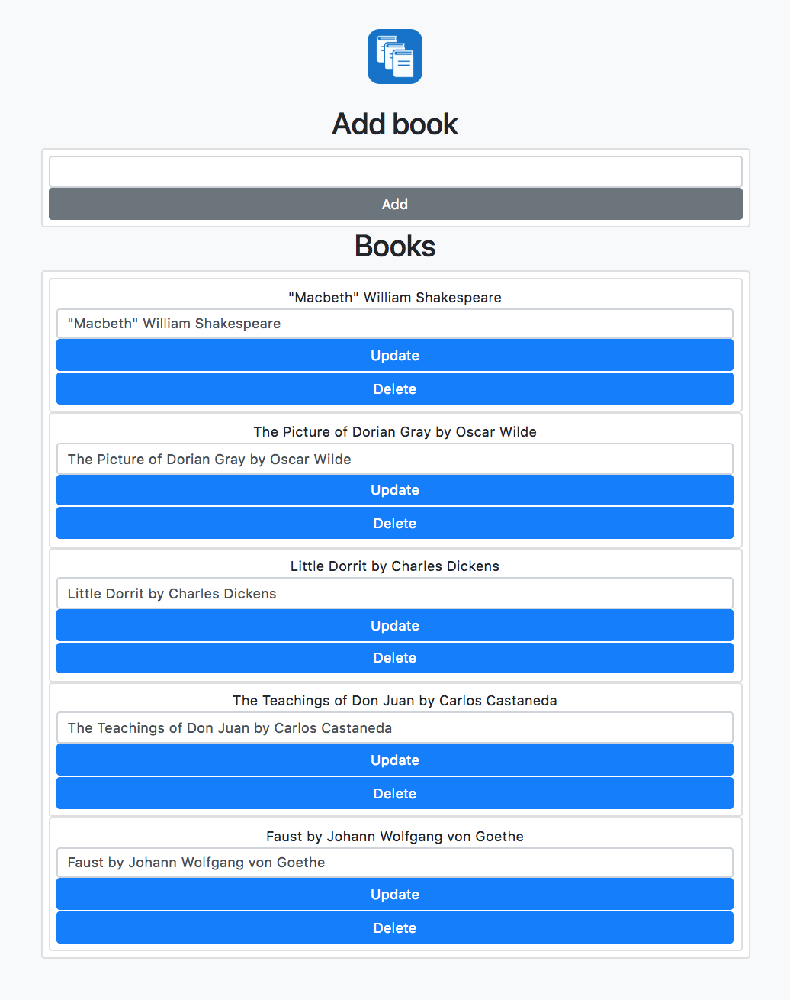

# JustBookManager

### Exercise for tutorial "Building a CRUD application with Flask and SQLAlchemy" 

URL: at https://www.codementor.io/garethdwyer/building-a-crud-application-with-flask-and-sqlalchemy-dm3wv7yu2


Setup
-----

To get started with this project, you need:


1. Install Vagrant.
  Available at [http://www.vagrantup.com/downloads.html](http://www.vagrantup.com/downloads.html).


2. Install VirtualBox.
  Available at [https://www.virtualbox.org/wiki/Downloads](https://www.virtualbox.org/wiki/Downloads)


3. Install Git.
  Available at [http://www.gitscm.com/](http://www.gitscm.com/)


5. Clone this Repo.

  ```
  git@github.com:IrinaSerova/JustBookManager.git
  
  ```

Usage
-----

Once that's all done you can launch VM:

  ```
  cd vagrant
  vagrant up
  ```
Once up, you can ssh into the VM with:
  ```
  vagrant ssh
  ```

Initializing database
-----
Run the following commands in a Python shell in your project directory in order to create our database 

 ```
  
  from bookmanager import db
  db.create_all()
  exit()
  
  ```


 
 
